Zone plates and pinch zones. Code written in the dead of night. Meant to be read with closed eyes.

## Demo

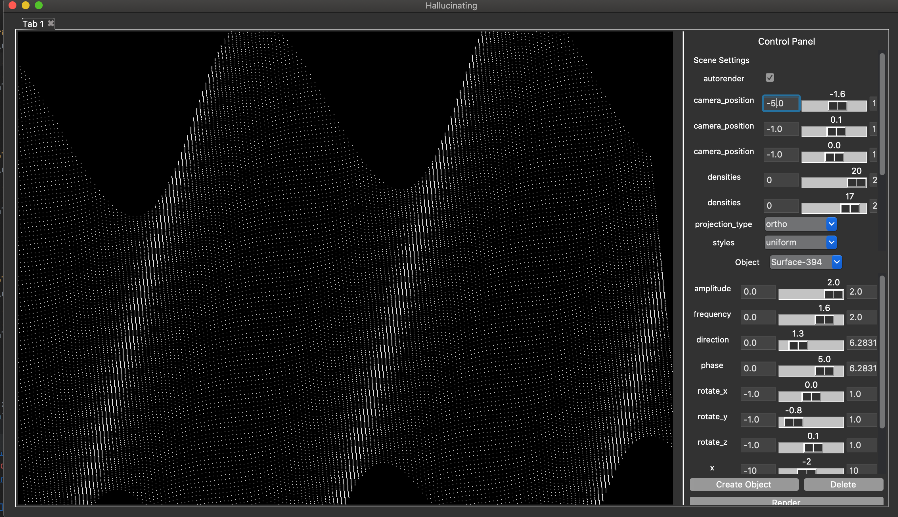
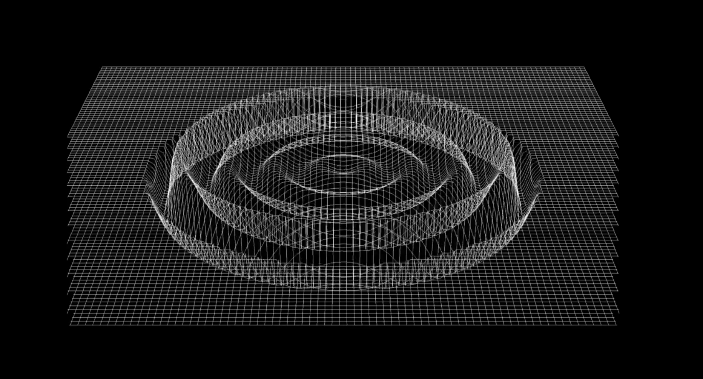
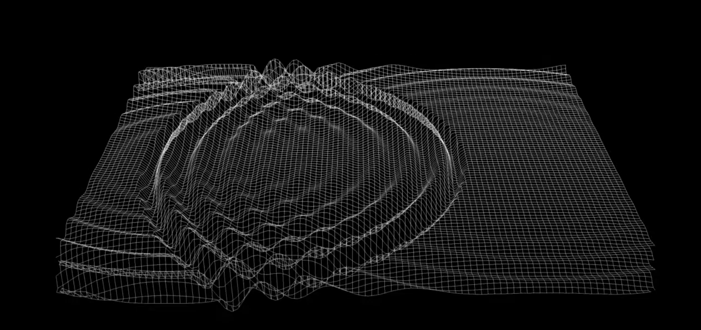

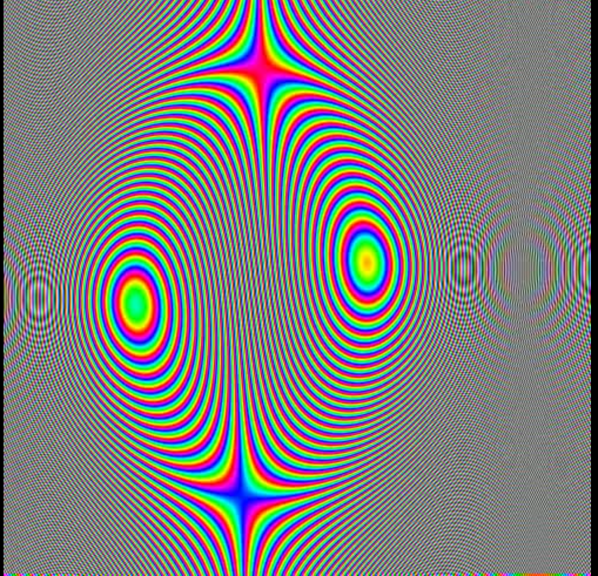
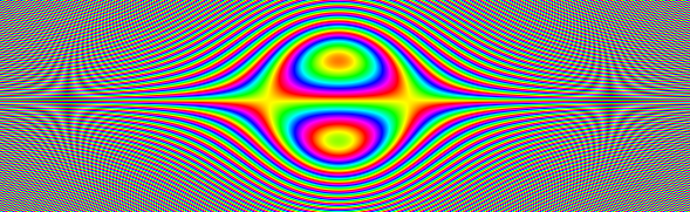
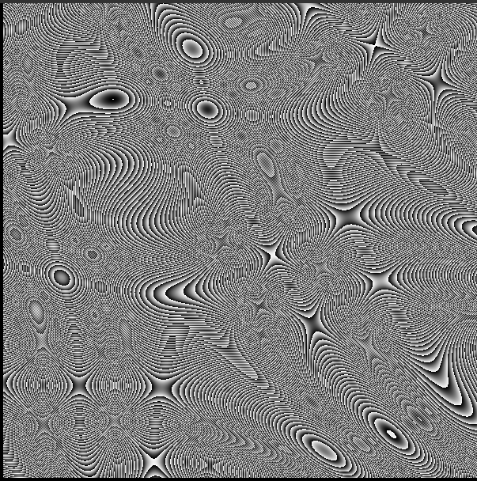

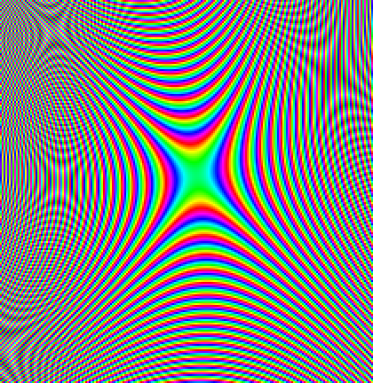
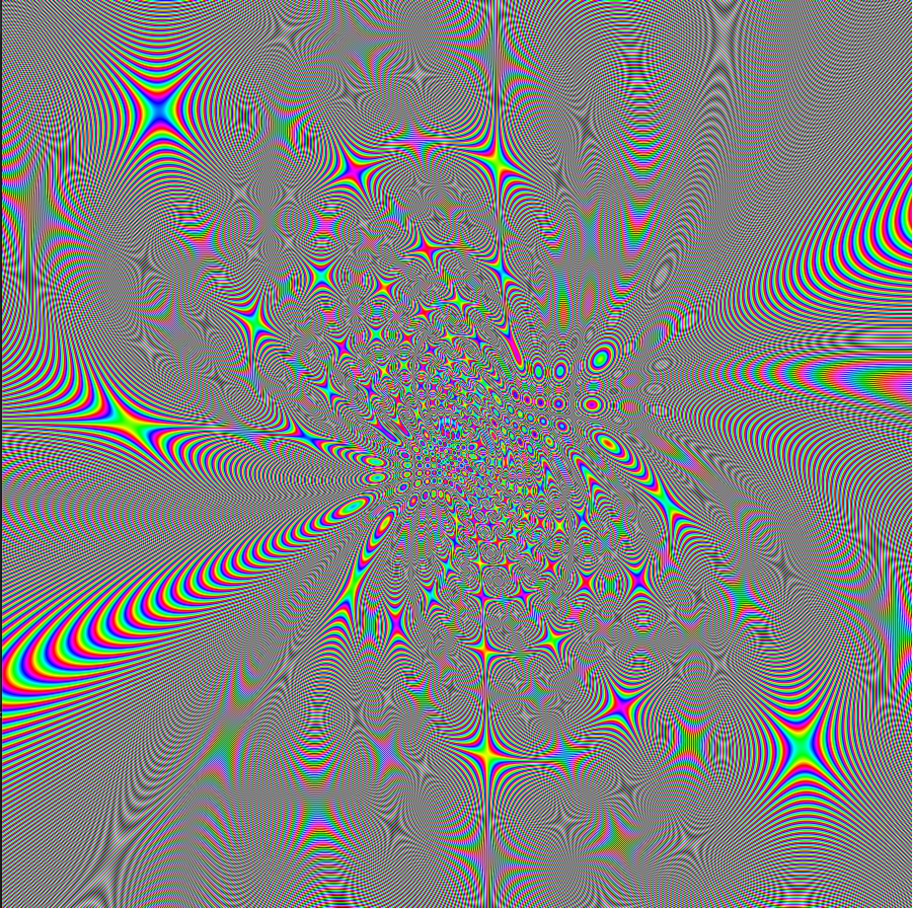


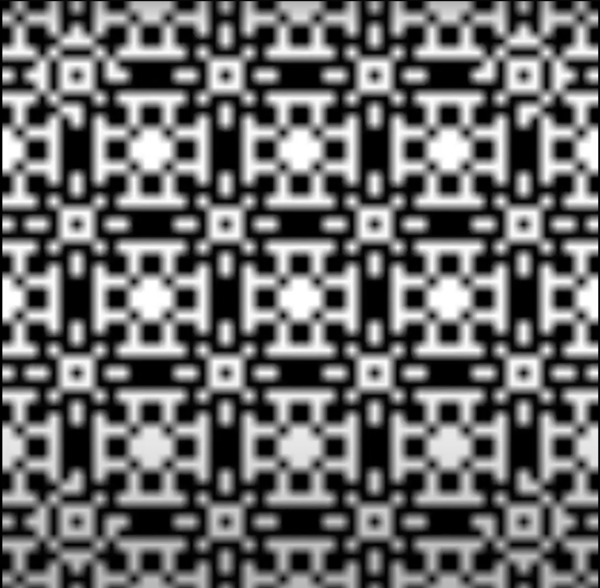
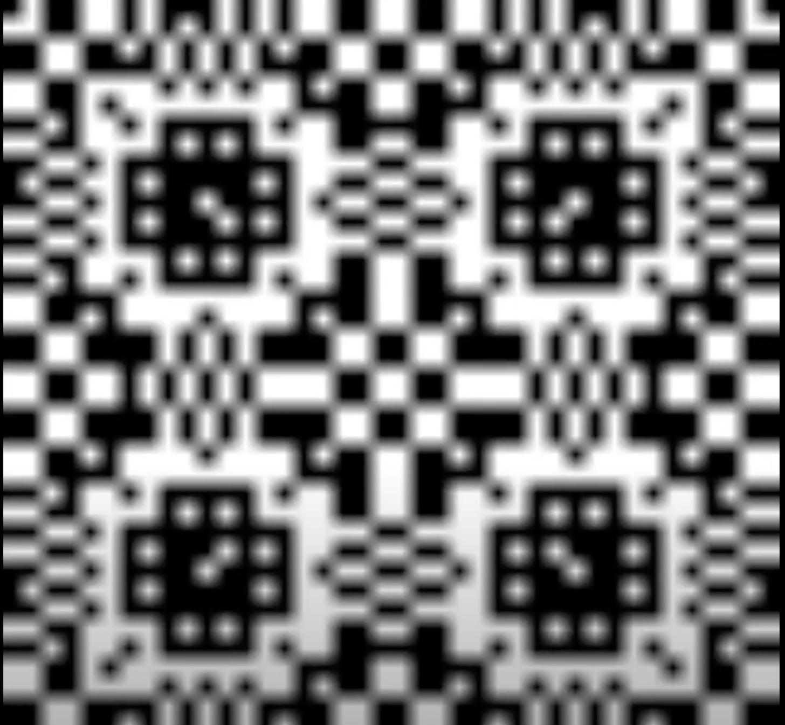
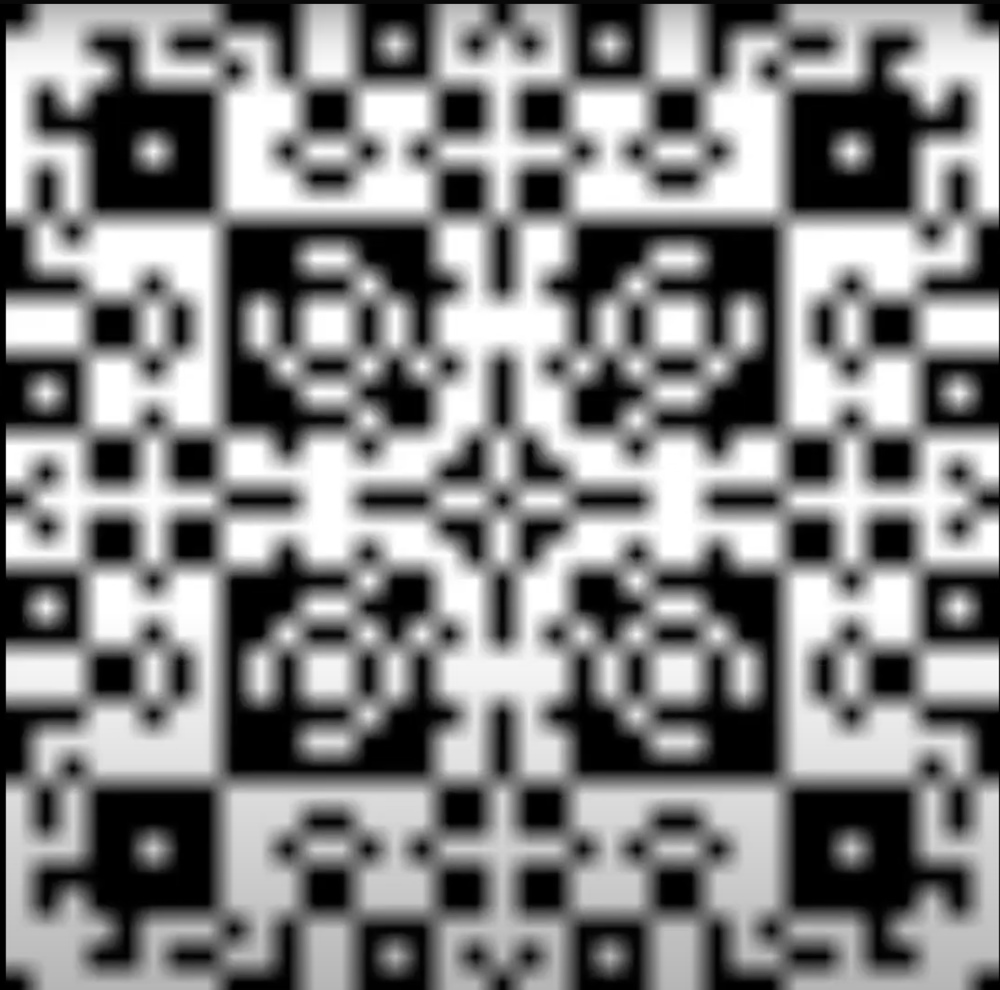
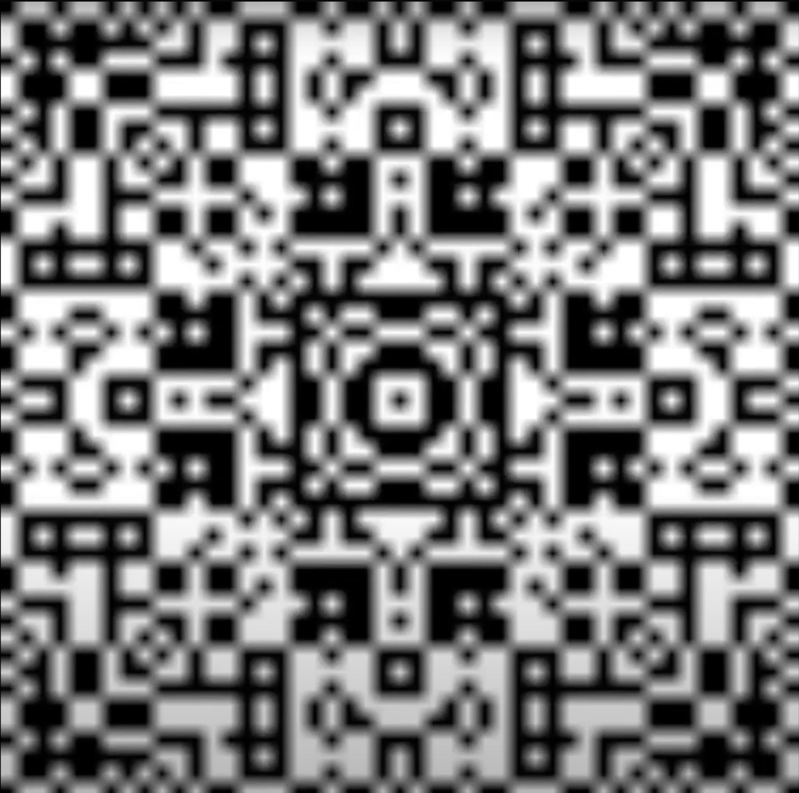


## Profiling


```
python -m cProfile -o profile.profile script.py`
pip install snakeviz
snakeviz profile.profile
```
